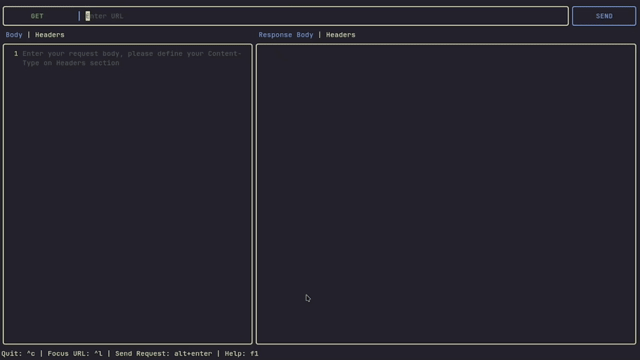

# RESTUI

RESTUI is a Terminal User Interface API client designed for testing HTTP requests directly into your terminal.



## Installation

### Using AUR

```bash
# yay
yay -S restui

# paru
paru -S restui
```

### Using Homebrew 

```bash
brew tap arfadmuzali/restui
brew install restui
```

### Using Go Install
- Requirement
[Go 1.22 or latest](https://go.dev/doc/install)

```bash
go install github.com/arfadmuzali/restui@latest
```
Please note: If you get an error claiming that restui cannot be found or is not defined, you need to add ~/go/bin to your $PATH (MacOS/Linux), or %HOME%\go\bin (Windows). Not to be mistaken for C:\Go\bin (which is for Go's own binary).

### Install From Source
```bash
git clone https://github.com/arfadmuzali/restui.git
cd restui
go build -o restui
# Move ./restui file into your bin
```
All releases are alvailable on Github Release

## Uninstall

By default RESTUI make a config directory inside your machine, so if you want to uninstall RESTUI make sure to delete the configuration

```bash
# For Linux
$HOME/.config/restui/

# For Windows
C:\Users\<USERNAME>\AppData\Roaming\restui\

# For Mac
/Users/<USERNAME>/Library/Application Support/restui/
```
then remove the RESTUI application here

```bash
# For Linux and Mac
$HOME/go/bin

# For Windows
C:\Users\<USERNAME>\go\bin
```


## Next Features

Here is what i am planning to:

- [x] Suggestion when tping on URL
- [x] Buffers/Tabs manager
- [ ] Cookies section
- [ ] Websocket

## Acknowledgments

This project stands on the shoulders of giants:

- [Bubble Tea](https://github.com/charmbracelet/bubbletea) - The wonderful TUI framework that makes this all possible
- [Bubbles](https://github.com/charmbracelet/bubbles)- Components for Bubble Tea applications
- [Lip Gloss](https://github.com/charmbracelet/lipgloss) - Style definitions for nice terminal layouts
- [BubbleZone](https://github.com/lrstanley/bubblezone) - Allow us to use mouse in Bubble Tea app

## Note

This project is under active development. Features and documentation may change frequently.
